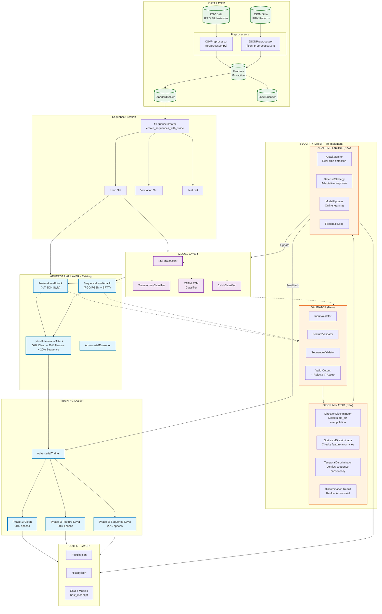

## Architecture Details

### Composants Existants:
- **Data Layer**: CSV/JSON preprocessing, feature extraction, scaling
- **Sequence Creation**: Windowing with stride for temporal sequences
- **Models**: LSTM, Transformer, CNN-LSTM, CNN classifiers
- **Adversarial Layer**: Feature-level, Sequence-level, Hybrid attacks
- **Training**: 3-phase adversarial training (60% clean + 20% feature + 20% sequence)

### Composants à Implémenter:

| Composant | Rôle |
|-----------|------|
| **Validator** | Valide les entrées avant inference - détecte les features invalides |
| **Discriminator** | Distingue les échantillons réels des adversariaux |
| **Adaptive Engine** | Adaptation en temps réel aux attaques détectées |

Voulez-vous que je génère le code de ces composants?
